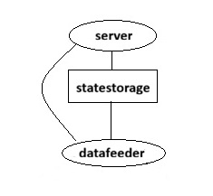
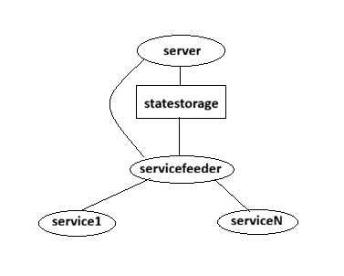

**(C) 2026 Ford Motor Company** 

# VISSR feeders

A feeder is deployed on the south side of the state storage.
Its high-level responsibility is to act as an integration layer for the communication between the VISS/HIM domain and the native vehicle domain.\
Two variants of feeders exist, datafeeders handle data based communication, while servicefeeders handle the sevice based communication.

A datafeeder is a SwC that has the following main tasks:
* Realizing the interface towards the state storage and the server.
* Converting data between the two domains - the vehicle native data format and the VSS data format.
* Realizing the interface towards the underlying vehicle system.

The tech stack Sw architecture involving a datafeeder is shown below.
\
* Fig. 1 Data feeder Sw architecure

A servicefeeder is partitioned into multiple SwCs - one servicefeederhub and one or more service end points.

The servicefeederhub has the following main tasks:
* Realizing the interface towards the state storage and the server.
* Act as a proxy between the service end points and the server / state storage.
* Keep track of the life cycle of the service end points.

A service end point has the following main tasks:
* Execute the service.
* Convert data between the two domains.
* Input/output communication with the servicefeederhub.

The tech stack Sw architecture involving a servicefeeder is shown below.
\
* Fig. 2 Service feeder Sw architecure

The VISSR server and state storage is designed to be able to handle multiple feeders that can be zero or more of any of the two variants.
At least one feeder must be deployed.
